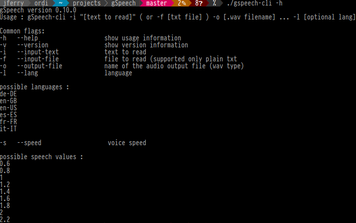

# gSpeech

[](https://travis-ci.org/mothsART/gSpeech)
[](https://www.gnu.org/licenses/gpl-3.0)

## Introduction

gSpeech is a minimal GUI for the Text To Speech 'Svox Pico'.
Read clipboard or selected text in different languages and manage it : pause, stop, replay.

## Last stable version

[](https://repology.org/project/gspeech/versions)

- Ubuntu 18.04, 19.10 and 20.04: [PPA](https://launchpad.net/~jerem-ferry/+archive/ubuntu/tts)

## Installation instruction

Ubuntu:

Depends: python (>=3.5) python3-gst-1.0 (>=1.0) python3-gi (>=2.24) libttspico-utils (>= 1.0) python-notify (>=0.1) gstreamer1.0-plugins-base gstreamer1.0-plugins-good gstreamer1.0-pulseaudio

Suggests: sox (is needed to speech text with more than 2^15 characters)

## Screenshots

<div align="center">
    
    
</div>

## CLI usage

```sh
./gspeech-cli -i "mon chat s'appelle maurice" -o speech/tests/fr_FR/assets/chat_maurice.wav
```

## Docker

```sh
make docker build.{env}
make docker run.{env}
```

## Tests

```sh
make test
```

## Create a Debian package

```sh
make build.debian
```

and launch with :

```sh
sudo dpkg -i ../gspeech*_all.deb
```

## Create a Nix package

```sh
nix build
```

## Clean (generate files)

```sh
make clean
```
