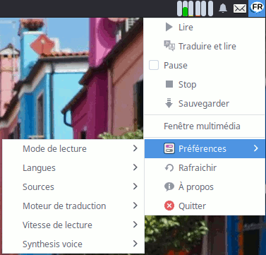
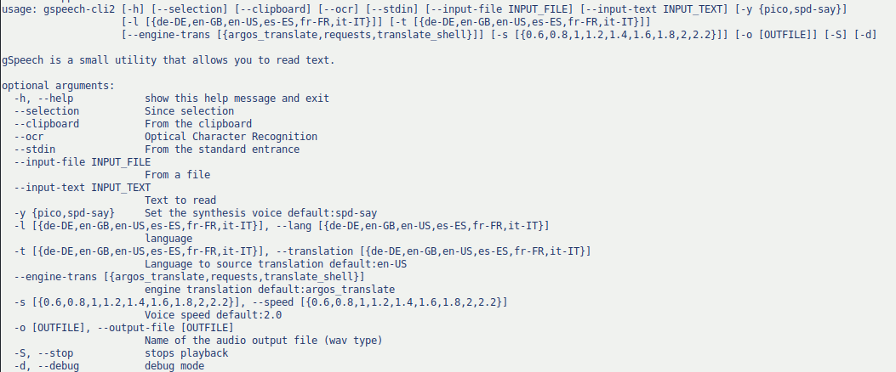

# gSpeech

[](https://www.gnu.org/licenses/gpl-3.0)

## Introduction

gSpeech is a minimal GUI for the Text To Speech 'Svox Pico'.
Read clipboard or selected text in different languages and manage it : pause, stop, replay.

## Last stable version

[](https://repology.org/project/gspeech/versions)

- Ubuntu 18.04, 19.10 and 20.04: [PPA](https://launchpad.net/~jerem-ferry/+archive/ubuntu/tts)

## Installation instruction

Ubuntu:

Depends: python (>=3.5) python3-gst-1.0 (>=1.0) python3-gi (>=2.24) libttspico-utils (>= 1.0) gstreamer1.0-plugins-base gstreamer1.0-plugins-good gstreamer1.0-pulseaudio gir1.2-appindicator3-0.1

### install pico

Suggests: sox (is needed to speech text with more than 2^15 characters)

```sh
sudo apt install libttspico-utils sox
```

### install speech-dispatcher

```sh
sudo apt install espeak mbrola-fr1 mbrola-fr4 speech-dispatcher
```

```sh
cp -r ./speech-dispatcher  ~/.config
```

### install tesseract

will be used to read the text in the images

```sh
sudo apt install tesseract-ocr-fra xfce4-screenshooter
```

### install argos-translate

Attention it is installation takes more than 1go destocking

- https://github.com/argosopentech/argos-translate

```sh
cd ~/.local/share
mkdir argos-translate
cd argos-translate
python3 -m venv venv
source venv/bin/activate
pip install argostranslate
ln -s $(which argos-translate-cli) ~/.local/bin/
```

### install translate-shell

- https://github.com/soimort/translate-shell

```shell
cd ~/.local/share
git clone https://github.com/soimort/translate-shell
cd translate-shell
make PREFIX=~/.local/bin/ install
```

## Screenshots

<div align="center">
    
    
    
    
</div>

## CLI usage

```sh
./gspeech-cli -i "mon chat s'appelle maurice" -o speech/tests/fr_FR/assets/chat_maurice.wav
```

```sh
./gspeech-cli2 --input-text "mon chat s'appelle maurice"
```

Stop playback

```sh
./gspeech-cli2 -S
```

## Add keyboard shortcuts for example

| commande                        | keyboard shortcuts |
| ------------------------------- | ------------------ |
| `./gspeech-cli2 --selection`    | `Super+²`          |
| `./gspeech-cli2 --selection -t` | `Super+É`          |
| `./gspeech-cli2 -S`             | `Maj+Échap`        |

## Docker

```sh
make docker build.{env}
make docker run.{env}
```

## Tests

```sh
make test
```

## Create a Debian package

```sh
make build.debian
```

and launch with :

```sh
sudo dpkg -i ../gspeech*_all.deb
```

## Create a Nix package

```sh
nix build
```

## Clean (generate files)

```sh
make clean
```
